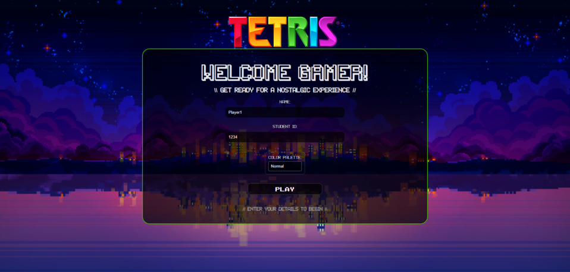
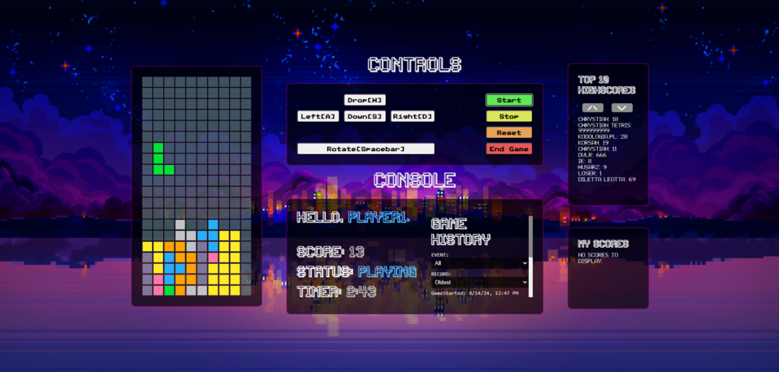

# ANGULAR Exam - TetrisApp

Final project for Angular course at JavaScript Developer postgraduate studies. It showcases best practices, usage of built-in solutions within new Angular 17.
To check how it works you need to:

1. Clone / download project repository.
2. Start local game server to download highscores list:

(in games-server directory)

> npm install
>  
> npm run start port:8080
>  
> !IMPORTANT you need to pass optional argument for port:8080 to make it work

3. In main directory:
   > npm install
   >  
   > ng serve

Technologies:
 

 
Game core provided by: https://github.com/chrum/ngx-tetris
